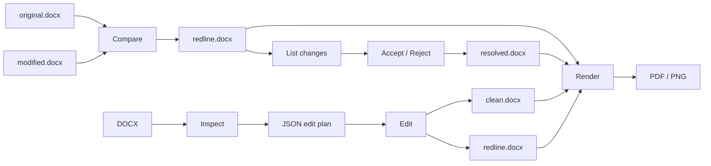

<!--
SPDX-FileCopyrightText: 2026 Jandira Technologies, LLC

SPDX-License-Identifier: AGPL-3.0-only
-->

<!-- Generated by scripts/library_readmes.py from README.md for v0.11.3 (README.md sha256 95ad98bdd12ba9fa). Edit those, not this file. -->

> **See every page side by side: [jandira-tech.github.io/neurotic_docx_bench](https://jandira-tech.github.io/neurotic_docx_bench/)**  
> jubarte vs Microsoft Word, docxide-pdf, LibreOffice, PyMuPDF Pro, MiniPdf, rdocx and office2pdf on 808 documents, DOCX to PDF, scored per page.

# jubarte

[](https://github.com/jandira-tech/jubarte-redlines/actions/workflows/ci.yml)
[](https://codecov.io/gh/jandira-tech/jubarte-redlines)
[](https://crates.io/crates/jubarte-redlines)
[](https://docs.rs/jubarte-redlines)
[](https://pypi.org/project/jubarte-redlines/)
[](https://www.npmjs.com/package/jubarte-wasm)
[](https://github.com/jandira-tech/jubarte-redlines/blob/v0.11.3/Cargo.toml)
[](https://github.com/jandira-tech/jubarte-redlines/blob/v0.11.3/LICENSE)

**Word-faithful DOCX redlines and rendering, without Word.**

Compare two Word documents into native tracked changes, inspect or resolve
changes programmatically, apply validated edit plans, and render DOCX to PDF
or PNG — from Rust, Python, Node/browser, or the CLI.

Jubarte is an in-process DOCX engine for applications that need Microsoft
Word-style review workflows without automating Microsoft Word or LibreOffice.

- **Compare DOCX → tracked DOCX** with native insertions, deletions, moves and
  formatting changes.
- **List, accept or reject changes** globally or selectively by change ID,
  author and kind.
- **Render DOCX → PDF / PNG** with an independent Word-oriented layout engine.
- **Inspect and edit documents safely** using paragraph IDs, source hashes and
  atomic JSON edit plans.
- **Use the same core engine everywhere**: Rust, CLI, Python and WebAssembly
  for Node/browser.
- **Keep the original package**: relationships, styles, headers/footers,
  notes, media and other DOCX parts are preserved by the comparison workflow.

> Jubarte is not affiliated with Microsoft. “Word-faithful” describes
> engineering targets measured against Microsoft Word behavior; it is not a
> claim that every DOCX will render byte-for-byte or page-for-page identically.

**Live benchmark, every page against Microsoft Word:
[jandira-tech.github.io/neurotic_docx_bench](https://jandira-tech.github.io/neurotic_docx_bench/)**
· tables: [neurotic_docx_bench RESULTS.md](https://github.com/jandira-tech/neurotic_docx_bench/blob/main/RESULTS.md)

## Feedback and contributions

Report bugs and request enhancements in the public
[issue tracker](https://github.com/jandira-tech/jubarte-redlines/issues), which
also archives reports and responses. English reports are welcome. See
[CONTRIBUTING.md](https://github.com/jandira-tech/jubarte-redlines/blob/v0.11.3/CONTRIBUTING.md) for pull requests, coding requirements,
building and tests, and [SECURITY.md](https://github.com/jandira-tech/jubarte-redlines/blob/v0.11.3/SECURITY.md) for private vulnerability
reports. The [OpenSSF evidence review](https://github.com/jandira-tech/jubarte-redlines/blob/v0.11.3/docs/OPENSSF.md) tracks the criteria
and outstanding maintainer attestations.

## Quick start

Install the CLI:

```sh
cargo install jubarte-redlines
jubarte --version
```

Prebuilt archives are also published on
[GitHub Releases](https://github.com/jandira-tech/jubarte-redlines/releases).
Check the assets attached to the release you intend to install.

### Compare two Word documents

```sh
jubarte original.docx modified.docx \
  -o redline.docx \
  --author "Reviewer"
```

`redline.docx` contains native Word tracked changes.

Without `-o`, Jubarte derives an output name beside the original document.

### Inspect and resolve tracked changes

```sh
jubarte changes redline.docx --json

# Resolve one specific change and leave the others tracked:
jubarte accept redline.docx \
  -o partially-accepted.docx \
  --id body:rev:12

# Or resolve everything:
jubarte accept redline.docx -o final.docx
jubarte reject redline.docx -o original-state.docx
```

Selection flags can be repeated and combined:

```sh
jubarte reject redline.docx \
  -o reviewed.docx \
  --author "Reviewer A" \
  --kind formatting
```

### Render DOCX to PDF or PNG

```sh
# PDF
jubarte convert redline.docx \
  -o redline.pdf \
  --revisions word \
  --compress

# Page images
jubarte convert redline.docx \
  --png \
  --dpi 120
```

No Microsoft Word or LibreOffice process is launched.

## How the workflow fits together



## Documentation

Per-surface guides, each ending in a **generated** reference (CLI help from
the real runner, API from the shipped module) that CI keeps drift-free —
`scripts/gen_docs.sh` regenerates them:

- [Rust guide](https://github.com/jandira-tech/jubarte-redlines/blob/v0.11.3/docs/rust.md) — crate features, API tour, rendering styles, `jubarte` CLI reference
- [Python guide](https://github.com/jandira-tech/jubarte-redlines/blob/v0.11.3/docs/python.md) — wheel and `uvx`, the three library tiers, generated API reference
- [Node and browser guide](https://github.com/jandira-tech/jubarte-redlines/blob/v0.11.3/docs/javascript.md) — `jubarte-wasm` and `npx jubarte-redlines`, entry points, generated API reference

Topical documents: [Markdown pipeline](https://github.com/jandira-tech/jubarte-redlines/blob/v0.11.3/docs/MARKDOWN.md) ·
[Word differences](https://github.com/jandira-tech/jubarte-redlines/blob/v0.11.3/docs/WORD_DIFFERENCES.md) ·
[Word layout rules](https://github.com/jandira-tech/jubarte-redlines/blob/v0.11.3/docs/WORD_LAYOUT_RULES.md) ·
[comment balloons](https://github.com/jandira-tech/jubarte-redlines/blob/v0.11.3/docs/WORD_COMMENT_BALLOONS.md) ·
[self-update](https://github.com/jandira-tech/jubarte-redlines/blob/v0.11.3/docs/SELF_UPDATE.md) ·
[benchmark classes](https://github.com/jandira-tech/jubarte-redlines/blob/v0.11.3/docs/bench_classes.md) ·
[per-release API snapshots](https://github.com/jandira-tech/jubarte-redlines/blob/v0.11.3/docs/api/README.md).

## Install

### CLI

```sh
cargo install jubarte-redlines
```

The installed binary is named `jubarte`.

From 0.11.0, the Python wheel and the npm package also run the CLI
without an install:

```sh
uvx jubarte-redlines redline a.docx b.docx -o redline.docx
npx jubarte-redlines redline a.docx b.docx -o redline.docx
```

Both runners speak the shared command set — `compare`/`redline`,
`revisions`, `changes`, `accept`, `reject`, `inspect`, `text`, `edit`,
`convert`, `capabilities` — but not the whole binary surface: the Python
wheel and npm CLI now include `diff` and share the Rust clap parser for
help, defaults, aliases and usage errors. Native-only tasks such as
`debug` and `self-update` remain in the binary. The npm CLI renders no PNG
pages
([`jubarte-wasm/cli/README.md`](https://github.com/jandira-tech/jubarte-redlines/blob/v0.11.3/jubarte-wasm/cli/README.md)).

For a GitHub-style text review of two Word documents:

```sh
jubarte diff a.docx b.docx --format github
jubarte diff a.docx b.docx --format github --context 5 -o changes.patch
uvx jubarte-redlines diff a.docx b.docx --format github
npx jubarte-redlines diff a.docx b.docx --format github
```

`github` (also `unified` or `text`) prints a standard unified patch with
`diff --git`, file headers, hunk ranges and context. It compares the complete
`debug -c text` view, including existing revision marks and story text in
headers, footers, notes, comments, tables and text boxes. It extracts all content before display clipping and never caps the number of changes, and does not create an implicit
DOCX. Header/footer part renumbering is paired by section role. This is a
patch of extracted **text**, for review; it cannot patch a binary DOCX.
Formatting and media differences belong to `compare`, `debug` or `diff-render`.

CriticMarkup keeps its existing role: representing a document's current
content with its tracked marks and comments. `github` gives a separate
comparison of those contents; it does not accept, reject or reinterpret the
marks unless `--accept-changes` is requested. `--format word` always accepts
ALL changes in both inputs first, then produces fresh word-level CriticMarkup.
`normal`, `context` and `side-by-side` are also available. Long lines show a
70-character window around the first change; `--full-lines` shows everything.
See [text diff details](https://github.com/jandira-tech/jubarte-redlines/blob/v0.11.3/docs/TEXT_DIFF.md).

> **Unreleased (on main, ships with the next release).** The runner
> one-liners above, plus a Markdown pipeline beside Word: `jubarte diff`
> prints the changes between any two documents, Word or Markdown, as a
> git-style patch; `jubarte convert draft.md` writes CommonMark (with
> CriticMarkup as tracked changes) to DOCX/PDF/PNG; and `jubarte edit`
> writes the redline's patch as `patch.diff`. See
> [`docs/MARKDOWN.md`](https://github.com/jandira-tech/jubarte-redlines/blob/v0.11.3/docs/MARKDOWN.md) and
> [`CHANGELOG.md`](https://github.com/jandira-tech/jubarte-redlines/blob/v0.11.3/CHANGELOG.md).

For a source checkout, the repository also contains installation scripts that
can install supplemental fonts used by the renderer:

```sh
scripts/install.sh
scripts/install.sh --fonts-only
```

On Windows, see `scripts/install.ps1`.

### Rust library

```sh
cargo add jubarte-redlines --no-default-features
```

The package is called `jubarte-redlines`; the Rust library import path is
`jubarte`.

```rust
use jubarte::{convert, document_comparer};

fn main() -> Result<(), Box<dyn std::error::Error>> {
    let original = std::fs::read("original.docx")?;
    let modified = std::fs::read("modified.docx")?;

    let redline =
        document_comparer::compare_documents(&original, &modified, "Reviewer")?;
    std::fs::write("redline.docx", &redline)?;

    let pdf = convert::docx_to_pdf(&redline)?;
    std::fs::write("redline.pdf", &pdf)?;

    Ok(())
}
```

The default crate features include the CLI, fast allocator and self-update
support. Library-only consumers can disable defaults and opt into features
deliberately.

MSRV: **Rust 1.94**.

### Python

Python requires CPython 3.10 or later.

```sh
pip install jubarte-redlines
```

Low-level byte API:

```python
from pathlib import Path
from jubarte_redlines import (
    compare_documents,
    get_revisions,
    docx_to_pdf,
)

original = Path("original.docx").read_bytes()
modified = Path("modified.docx").read_bytes()

redline = compare_documents(
    original,
    modified,
    author="Reviewer",
)
Path("redline.docx").write_bytes(redline)

for revision in get_revisions(redline):
    print(revision)

Path("redline.pdf").write_bytes(
    docx_to_pdf(redline, revisions="word")
)
```

The richer `Document` API additionally supports inspection, Markdown
projection, selective change resolution, edit plans, PDF/PNG rendering and
preview.

### Node and browser

Node 18+:

```sh
npm install jubarte-wasm
```

```js
const {
  compareDocuments,
  docxToPdf,
  listChanges,
  acceptChanges,
  rejectChanges,
} = require("jubarte-wasm");

const redline = compareDocuments(originalBytes, modifiedBytes, "Reviewer");
const pdf = docxToPdf(redline, false, "word");
```

For applications that do not need the PDF renderer, use the slim package
exports:

```js
const {
  compareDocuments
} = require("jubarte-wasm/slim");
```

Browser builds are exported from `jubarte-wasm/web` and
`jubarte-wasm/web-slim`.

### MCP server

`jubarte-mcp` exposes the engine as MCP tools (read, edit as tracked
changes, render, compare, accept and reject) to coding agents. Every path
stays under `--root`.

| Host | Install |
| --- | --- |
| Claude Code | `claude mcp add --transport stdio jubarte --scope project -- uvx --from 'jubarte-redlines[mcp]' jubarte-mcp --root .` |
| Codex | `codex mcp add jubarte -- uvx --from 'jubarte-redlines[mcp]' jubarte-mcp --root .` |
| Gemini CLI | `gemini extensions install https://github.com/jandira-tech/jubarte-redlines` |

Tools, security model and config files: [docs/adoption/mcp.md](https://github.com/jandira-tech/jubarte-redlines/blob/v0.11.3/docs/adoption/mcp.md).

## CLI reference

Every command, from `jubarte --help` (regenerated by `scripts/gen_docs.sh`).
The complete per-command `--help` of every runner (the `jubarte` binary, the
Python wheel, the npm CLI) is in the [per-surface guides](#documentation).

<!-- gen:cli-summary:start -->
| Command | What it does |
|---|---|
| `jubarte ORIGINAL MODIFIED` | Read, edit, compare and render Word documents |
| `jubarte compare` | Compare documents and write a Word redline [alias: redline] |
| `jubarte revisions` | List the tracked revisions in a redline .docx |
| `jubarte changes` | List tracked changes with IDs for accept, reject and edit plans |
| `jubarte accept` | Accept all tracked changes, or select by ID, author or kind |
| `jubarte reject` | Reject all tracked changes, or select by ID, author or kind |
| `jubarte convert` | Convert Word or Markdown to DOCX, PDF, PNG or Markdown |
| `jubarte diff` | Review differences as GitHub, word, normal, context or side-by-side text |
| `jubarte inspect` | Inspect document facts, paragraphs, styles and tables |
| `jubarte read` | Read the agent view: YAML header, `<!-- pN -->` id lines, changes and comments with ids [alias: text] |
| `jubarte edit` | Edit a document: -p WHERE with --anchor, --content, --delete, --resolve or --style (several -p per command), or a JSON plan. Writes clean copy, redline, patch and report, then prints the changed paragraphs as the agent view (refusal: exit 3) |
| `jubarte add` | Add a paragraph, a comment or a reply: -p WHERE --content TEXT (several -p per command). Writes the same files as edit and prints the changed paragraphs as the agent view |
| `jubarte capabilities` | What this binary can do, for agents choosing an operation |
| `jubarte self-update` | Check or install a release from GitHub |
| `jubarte debug` | Diagnose a Word package, or compare package structures |
| `jubarte diff-render` | Compare rendered pages pixel by pixel (different pages: exit 5) |
| `jubarte comments` | List comments, threads and the text they annotate |
| `jubarte append` | Join documents in order, preserving images, styles, lists and notes |
| `jubarte validate` | Check or repair Word validity (findings: exit 2; unreadable: exit 1) |
| `jubarte fields` | Field results written back into the document from jubarte's layout |
| `jubarte scrub` | Remove authors, editing IDs, metadata and comments before sharing |
| `jubarte audit` | Audit accessibility, style and structure (findings: exit 2) |
<!-- gen:cli-summary:end -->

### Compare

```text
jubarte ORIGINAL MODIFIED [OPTIONS]
```

Without `-o`, `jubarte A B` prints the redline as the agent view (the
`read` options apply) and writes nothing; `-o FILE` writes it, and
`jubarte compare A B` writes `<A>_v_<B>.docx` as before. `jubarte FILE`
alone is `jubarte read FILE`.

Common options:

| Option | Purpose |
|---|---|
| `-b, --original FILE` | Original document |
| `-m, --modified FILE` | Modified document |
| `-o, --output FILE` | Output tracked-changes DOCX |
| `-a, --author NAME` | Revision author |
| `-d, --date ISO8601` | Revision timestamp |
| `--detail-threshold RATIO` | Comparison-detail tuning |
| `--mode word|powertools` | Word-oriented or classic PowerTools comparison behavior |
| `--force` | Replace an existing output |
| `-q, --quiet` | Reduce CLI output |

The default comparison date is deterministic rather than “now”, making
identical inputs reproducible unless a date is explicitly supplied.

### Inspect revisions

```sh
jubarte revisions FILE.docx
jubarte revisions FILE.docx --json

jubarte changes FILE.docx
jubarte changes FILE.docx --json
```

`changes` is intended for individually addressable review operations and
reports stable IDs while the corresponding tracked change remains present.

### Accept or reject

```sh
jubarte accept FILE.docx -o OUTPUT.docx
jubarte reject FILE.docx -o OUTPUT.docx
```

Optional selection filters:

```text
--id ID
--author NAME
--kind insertion|deletion|move|formatting
```

Filters are repeatable. Categories combine, so a change must satisfy each
category you supplied.

### Convert to PDF / PNG

```sh
jubarte convert FILE.docx [OPTIONS]
```

| Option | Purpose |
|---|---|
| `-o, --output FILE` | Output path |
| `--pdf` | Request PDF output |
| `--png` | Request page PNG output |
| `--dpi DPI` | PNG resolution; default 96 |
| `--compress` | Deflate PDF content streams |
| `--revisions conventional|word|custom` | Tracked-change visualization |
| `--revision-palette SPEC` | Custom change colors/lines |
| `--font-report FILE` | Write font-resolution JSON |
| `--report FILE` | Write page/render report |
| `--force` | Replace existing output |
| `--fail-on-substitution` | Exit 4 when a requested font was substituted |
| `--pages SPEC` | Only these pages, for example `1-3,7` |
| `--move-comments` | List comments after the last page; the text keeps its tint and a `[JR1]` marker |
| `--changed-only` | Keep only the pages a tracked change touches (page numbers stay the document's) |
| `-f, --from` / `-t, --to` | `docx`, `md`, `pdf` or `png`: Markdown in (CriticMarkup becomes tracked changes) or out ([`docs/MARKDOWN.md`](https://github.com/jandira-tech/jubarte-redlines/blob/v0.11.3/docs/MARKDOWN.md)) |

Examples:

```sh
jubarte convert contract.docx
jubarte convert redline.docx --revisions word
jubarte convert redline.docx --png --dpi 144
jubarte convert long.docx --png --pages 1-3,7
jubarte convert contract.docx --compress --font-report fonts.json
```

A document with comments gets Word's markup pane: each comment in a
balloon beside its range, joined to it by a dotted connector, with the
range tinted and bracketed. `--revisions word` writes no comment annotation,
as Word does; the other styles keep a sticky note on the range as well
([`docs/WORD_DIFFERENCES.md`](https://github.com/jandira-tech/jubarte-redlines/blob/v0.11.3/docs/WORD_DIFFERENCES.md)).

A custom palette can be supplied with:

```sh
jubarte convert redline.docx \
  --revisions custom \
  --revision-palette \
  "deleted=#AA0000:strike,inserted=#0055FF:double-underline"
```

### Inspect document structure

```sh
jubarte inspect contract.docx --json
jubarte inspect contract.docx --tables   # each table as a grid of `ids=text` cells
jubarte read contract.docx               # the agent view (alias: text)
```

`inspect` exposes document metadata, story/paragraph coordinates, source
hashes, runs and structural limitations.

`read` prints the agent view: a YAML header (authors and their handles,
page setup, styles, headers, footers), then Markdown with an id line before
every paragraph (`p12` is `body:p:12`) and an id on every tracked change and
comment (`#3+4` is `body:rev:3` and `body:rev:4`, `#c5` is comment 5):

```text
<!-- p0 center -->
# Consulting Agreement

<!-- p1 justify -->
This Consulting Agreement (the “Agreement”) is made between Harbor Point Analytics LLC ("Consultant") and Juniper Freight Co. ("Client").

<!-- p2 -->
## 1. Services

<!-- p3 -->
Consultant will deliver the services in each Statement of Work, including {++quarterly++}{>>#0 @AC<<} route-cost reports and a {~~weekly~>monthly~~}{>>#1+2 @AC<<} review call.
```

See [docs/MARKDOWN.md](https://github.com/jandira-tech/jubarte-redlines/blob/v0.11.3/docs/MARKDOWN.md#agent-view) for the grammar.

### Validate

```sh
jubarte validate contract.docx
jubarte validate contract.docx --json
jubarte validate contract.docx --repair fixed.docx
jubarte validate review/redline.docx --original contract.docx --author Claude
```

`validate` lists what makes Word refuse or repair a file, beyond what an
XSD sees: one line per finding (`code`, `part#path`, message, a `*` when
it is Word-fatal), or one JSON object each with `--json`. Exit 0 is clean,
2 has findings, 1 could not read the file. `--repair` writes a copy with
every repairable finding fixed and lists what remains; `--original` with
`--author` audits that every text change against the original is a
revision by that author (`UNTRACKED_EDIT`, `FOREIGN_AUTHOR`).

| Option | Purpose |
|---|---|
| `--json` | JSON Lines: one object per finding, nothing when there is none |
| `--repair FILE` | Write the repaired package; remaining findings still exit 2 |
| `--original FILE` | Audit tracked edits against this original (needs `--author`) |
| `--author NAME` | The author every change must carry |
| `--force` | Replace an existing `--repair` output |

### Audit

```sh
jubarte audit contract.docx
jubarte audit contract.docx --rules a11y,structure --json
jubarte audit contract.docx --strict
```

Accessibility, style and structure findings, each located by paragraph id.
`--rules` takes rule sets (`a11y`, `style`, `structure`) or rule codes. Exit 0
when nothing fails, 2 on any `error` finding (on any `warning` too with
`--strict`).

### Scrub

```sh
jubarte scrub contract.docx -o outgoing.docx
jubarte scrub contract.docx -o outgoing.docx --rsids --docprops
```

Removes who touched a document before it goes out: author names (as one
alias, `--author-alias NAME`), rsids, the people and dates in the document
properties, and comments. Text and tracked changes stay. Without a flag all
four go, under the alias "Author"; with flags, only those given.

### Append documents

```sh
jubarte append a.docx b.docx c.docx -o combined.docx
jubarte append a.docx b.docx -o combined.docx --section-break continuous --keep-sections
```

B after A, then C after that, carrying images, links, styles, lists and
notes. Comments are dropped with a warning unless `--carry-comments`.
`--section-break` is `next-page` (the default), `continuous` or `none`;
`--keep-sections` keeps each document's page setup, headers and footers.

### Comments

```sh
jubarte comments contract.docx
jubarte comments contract.docx --json --author "Reviewer" --latest
```

Every comment with its thread (`parent`, `done`) and the text it is
anchored to. Edit plans reply to, resolve, edit and delete comments (see
the operation table below).

### Fields

```sh
jubarte fields update contract.docx -o updated.docx --json
```

Refreshes the cached results of `PAGEREF`, `REF`, `NUMPAGES`, `SEQ` and
`TOC` fields from jubarte's layout; TOCs are rebuilt from the headings. Field
codes stay, so Word can update them again. Page numbers are jubarte's layout,
not Word's ([`docs/WORD_DIFFERENCES.md`](https://github.com/jandira-tech/jubarte-redlines/blob/v0.11.3/docs/WORD_DIFFERENCES.md)).

### Compare rendered pages

```sh
jubarte diff-render before.docx after.docx
jubarte diff-render before.docx after.docx --out-dir pages --dpi 150 --json
```

Lays out and rasterizes both documents at one resolution and compares them
pixel for pixel. Exit 0 when every page is the same, 5 when any page
differs; `--out-dir` writes the changed pages, overlays and `diff.json`.

### Apply an edit plan

First inspect the source:

```sh
jubarte inspect contract.docx --json > inspect.json
```

Create `plan.json`:

```json
{
  "schema_version": 1,
  "source_sha256": "<source_sha256 from inspect>",
  "author": "Reviewer",
  "operations": [
    {
      "id": "term",
      "kind": "replace",
      "paragraph": "body:p:12",
      "find": "two years",
      "replacement": "three years"
    }
  ]
}
```

Preview it:

```sh
jubarte edit contract.docx \
  --plan plan.json \
  --out-dir review \
  --dry-run
```

Apply and render:

```sh
jubarte edit contract.docx \
  --plan plan.json \
  --out-dir review \
  --pdf \
  --png \
  --dpi 100
```

A successful edit can produce:

```text
review/
  clean.docx
  redline.docx
  patch.diff
  report.jsonl
  clean.pdf
  redline.pdf
  clean-page-01.png
  redline-page-01.png
  ...
```

Operation kinds (`jubarte capabilities` lists the ones the installed build
supports):

| Kind | What it does |
|---|---|
| `replace` | Replace `find` with `replacement` in one paragraph; optional `format` for the new text, `"whole": true` for one deletion then one insertion |
| `insert` | Insert text `after` or `before` a match, or at `position` `start`/`end` |
| `delete` | Delete a match |
| `rewrite` | Give a paragraph's whole new text; only the words that differ are edited |
| `format_run` | Restyle existing text as a tracked formatting change |
| `comment` | Comment on a match, a whole paragraph, or every paragraph up to `through` |
| `reply_comment`, `resolve_comment`, `edit_comment`, `delete_comment` | Work on a comment thread by `comment_id` |
| `insert_paragraph` | A new paragraph after the anchor, with its properties (or those `like` selects) |
| `delete_paragraph` | Delete a paragraph, optionally commenting on the deleted text |
| `format_paragraph` | Style, alignment, line spacing, space before and after, as a tracked property change |
| `merge_paragraphs` | Join the next paragraph onto this one |
| `insert_table` | A table before or after a body paragraph, tracked as inserted rows |
| `list` | Bulleted, numbered or lettered list, tracked as property changes |
| `insert_footnote` | A footnote after an anchor |
| `insert_image` | A picture paragraph (PNG, JPEG, GIF, BMP or TIFF) |
| `insert_toc` | A table of contents field; with `"update_fields": true` it is filled from the headings |
| `page_setup` | Page size, orientation and margins |
| `watermark` | Word's diagonal text watermark in every default header (untracked) |
| `fill_control` | Fill a content control (text, choice, checkbox or date) by id, tag or alias |
| `redact` | Replace text with `█` blocks in both copies, untracked; refused if the text still occurs anywhere |
| `settings` | `trackRevisions`, `updateFields` and document protection in `word/settings.xml` |

Plans are atomic: stale sources, ambiguous anchors, overlapping edits or
unsupported structures refuse the plan instead of making a guessed edit.

See
[`skills/jubarte-documents/SKILL.md`](https://github.com/jandira-tech/jubarte-redlines/blob/v0.11.3/skills/jubarte-documents/SKILL.md)
and
[`examples/agents/acme-letter`](https://github.com/jandira-tech/jubarte-redlines/blob/v0.11.3/examples/agents/acme-letter)
for the full plan schema and a complete example.

### Capabilities

```sh
jubarte capabilities
jubarte capabilities --json
```

Use this when an application or agent needs to discover the exact surface
supported by the installed build.

### Self-update

```sh
jubarte self-update --check
jubarte self-update
```

Optional:

```text
-y, --yes
--version VERSION
```

See [`docs/SELF_UPDATE.md`](https://github.com/jandira-tech/jubarte-redlines/blob/v0.11.3/docs/SELF_UPDATE.md).

### Debugging DOCX behavior

```sh
jubarte debug FILE.docx --list
jubarte debug FILE.docx --check render
jubarte debug FILE.docx -c text
jubarte debug FILE.docx -c runs
jubarte debug FILE.docx -c xml

jubarte debug diff A.docx B.docx
jubarte debug diff A.docx B.docx C.docx --full
```

Debug catalogs cover package structure, fields, bookmarks, IDs, styles,
text boxes, revision changes, numbering, normalized XML/text/runs and render
information.

Use `jubarte <command> --help` for the authoritative option list for the
installed release.

## Rendering and fonts

The PDF engine reconstructs Word-oriented layout directly; it does not call
Microsoft Word or LibreOffice.

The documented rendering surface includes:

- tracked changes, and comments as Word's balloons in the markup pane
  (a resolved comment faded, a reply numbered under its thread);
- paragraph/run formatting and advanced line layout;
- CJK and RTL/complex-script text;
- installed and embedded fonts;
- merged, vertically merged, autofit and floating tables;
- DrawingML/VML graphics, text boxes, charts and SmartArt;
- raster and EMF/WMF images;
- headers, footers and floating frames;
- sections, columns, backgrounds and page borders;
- footnotes and selected fields.

Rendering fidelity still depends on fonts and on document features.

Supplemental font lookup can be configured with:

```sh
export JUBARTE_FONT_DIR=/path/to/jubarte/fonts
export JUBARTE_FONT_INDEX=/path/to/font-index.tsv
```

Set:

```sh
export JUBARTE_FONT_INDEX=off
```

to disable the persistent font index.

Default per-user font directories are documented in the installation section
of this repository.

For known Word-layout differences, see:

- [`docs/WORD_LAYOUT_RULES.md`](https://github.com/jandira-tech/jubarte-redlines/blob/v0.11.3/docs/WORD_LAYOUT_RULES.md)
- [`docs/WORD_DIFFERENCES.md`](https://github.com/jandira-tech/jubarte-redlines/blob/v0.11.3/docs/WORD_DIFFERENCES.md)
- [`docs/WORD_COMMENT_BALLOONS.md`](https://github.com/jandira-tech/jubarte-redlines/blob/v0.11.3/docs/WORD_COMMENT_BALLOONS.md)

## Comparison modes

The default comparison mode is:

```sh
--mode word
```

It targets Word-like comparison behavior.

Classic PowerTools behavior is available with:

```sh
--mode powertools
```

Choose explicitly if exact comparison semantics matter to a regression test
or downstream workflow.

## Existing revisions in edit plans

An edit plan can refuse documents that already contain tracked changes, or
resolve them according to an explicit policy.

List changes before editing:

```sh
jubarte changes source.docx --json
```

Selective resolution can be part of the plan, for example:

```json
{
  "resolve_revisions": {
    "accept": {
      "ids": ["body:rev:12"]
    },
    "reject": {
      "authors": ["Previous Reviewer"]
    }
  }
}
```

Conflicting selections are rejected instead of silently choosing a side.

## Examples

### CLI

```sh
jubarte original.docx revised.docx \
  -o redline.docx \
  --author "Legal"

jubarte changes redline.docx --json

jubarte convert redline.docx \
  -o redline.pdf \
  --revisions word
```

### Python `Document`

```python
import jubarte_redlines as jubarte

doc = jubarte.read("contract.docx")

print(doc.markdown())
snapshot = doc.inspect()
print(snapshot)

pages = doc.to_png(dpi=120)
```

### Agent-style document editing

See
[`examples/agents/acme-letter`](https://github.com/jandira-tech/jubarte-redlines/blob/v0.11.3/examples/agents/acme-letter), which includes
an edit plan, generated report and rendered redline page.

## Safety and validation

CI currently includes:

- `cargo fmt --check`
- Clippy with `-D warnings` on the crate and on the Python, WASM
  (`wasm32-unknown-unknown`) and in-process bench bindings
- all-feature Rust tests on Linux, macOS and Windows
- source-based code coverage with a line-coverage floor
- MSRV testing on Rust 1.94 (the all-feature test suite, on Linux)
- `cargo publish --dry-run`
- `cargo-deny`
- REUSE/SPDX checks
- Python binding tests

The project also maintains package/schema validation and real-Microsoft-Word
opening probes for release work because an OOXML document can be schema-valid
and still trigger Word repair behavior.

See:

- [`KNOWN_ISSUES.md`](https://github.com/jandira-tech/jubarte-redlines/blob/v0.11.3/KNOWN_ISSUES.md)
- [`docs/VERSIONING.md`](https://github.com/jandira-tech/jubarte-redlines/blob/v0.11.3/docs/VERSIONING.md)
- [`docs/bench_classes.md`](https://github.com/jandira-tech/jubarte-redlines/blob/v0.11.3/docs/bench_classes.md)

## Benchmarks

Jubarte maintains Word-oracle benchmarks for both document comparison and
DOCX rendering.

The benchmark methodology, corpus provenance, current numbers and historical
results belong in:

- the [neurotic_docx_bench RESULTS.md](https://github.com/jandira-tech/neurotic_docx_bench/blob/main/RESULTS.md)
- the [page-by-page comparison site](https://jandira-tech.github.io/neurotic_docx_bench/)

Treat these as reproducible project-maintained measurements rather than as a
substitute for testing your own document corpus.

For important production workloads, benchmark representative documents from
your own environment before choosing an engine.

## Supported environments

| Surface | Supported/tested target |
|---|---|
| Rust / CLI | CI tests Linux, macOS and Windows |
| Rust toolchain | Rust 1.94+ |
| Python | CPython 3.10+ |
| Python release wheels | macOS x86_64/arm64, manylinux_2_28 x86_64/arm64, musllinux_1_2 x86_64/arm64, Windows x86_64 (abi3, CPython 3.10+) |
| Node | Node 18+ |
| Browser | WebAssembly builds |
| CLI release workflow | Linux x86_64/arm64, macOS x86_64/arm64, Windows x86_64 targets |

Release assets can vary by tag. Check the
[release page](https://github.com/jandira-tech/jubarte-redlines/releases)
before scripting a binary download.

A Word 97-2003 `.doc` converts to `.docx` with the native binary's
`jubarte convert old.doc` (or `jubarte::legacy_doc::doc_to_docx` in Rust):
text, headings, lists, bold, italic and tables. Every other command, and
the Python and JavaScript packages (the npm command line too), refuse a `.doc` (or an encrypted document of any Word
version) with `LEGACY_DOC` and the hint to save it as `.docx` without a
password, and RTF with `UNSUPPORTED_PACKAGE`. Convert them to `.docx` first.

## Troubleshooting

| Problem | What to check |
|---|---|
| PDF layout differs from Word | Verify required fonts; inspect `--font-report`; read `docs/WORD_DIFFERENCES.md` |
| Text is missing or wraps differently | Check font resolution and embedded/system font availability |
| Edit exits with a refusal | Read `report.jsonl` / stdout for `STALE_SOURCE`, `ANCHOR_NOT_FOUND`, `AMBIGUOUS_ANCHOR`, `OVERLAPPING_EDITS`, `UNSUPPORTED_STRUCTURE`, etc. |
| `STALE_SOURCE` | Re-run `jubarte inspect` and regenerate the plan from the new `source_sha256` |
| `AMBIGUOUS_ANCHOR` | Use a paragraph ID or a more specific exact anchor |
| Document already contains revisions | List them with `jubarte changes`; explicitly accept/reject them or set an edit-plan revision policy |
| Comment is present in DOCX but missing from rendered markup | Check the documented comment-balloon limitations and `docs/WORD_COMMENT_BALLOONS.md` |
| Output page count is not exactly Word's | The renderer targets Word behavior but is independent; inspect known differences before treating page count as an invariant |
| Prebuilt archive is absent for a platform | Install with Cargo or build from source; then check the release assets for a later tag |
| Need exact package differences | Use `jubarte debug diff` and the `text`, `runs`, `xml` or `render` debug catalogs |

## Roadmap

Proposed areas of focus:

- [ ] Stabilize and document a `1.0` compatibility policy.
- [ ] Keep every advertised binary/wheel target release-complete.
- [ ] Expand newcomer examples for CLI, Rust, Python, Node and browser.
- [ ] Improve editable coverage for currently unsupported DOCX structures.
- [ ] Continue closing documented Word-layout differences.
- [ ] Add a polished browser demo for compare/review/render workflows.
- [ ] Make benchmark environments easier for third parties to reproduce.
- [ ] Expand community documentation and contributor onboarding.

Roadmap items are goals, not compatibility guarantees.

## License

`jubarte-redlines` is licensed under
[GNU Affero General Public License v3.0 only](https://github.com/jandira-tech/jubarte-redlines/blob/v0.11.3/LICENSE)
(`AGPL-3.0-only`).

Review the license requirements before embedding or deploying the software in
a product or network service.

## Links

[Engine comparison site](https://jandira-tech.github.io/neurotic_docx_bench/) ·
[jandira.tech](https://www.jandira.tech) · [arthur.law](https://arthur.law) ·
[Cicero](https://www.cicero.im) · [LinkedIn](https://linkedin.com/in/arthrod) ·
`contact@arthur.law`
- [GitHub](https://github.com/jandira-tech/jubarte-redlines)
- [crates.io](https://crates.io/crates/jubarte-redlines)
- [docs.rs](https://docs.rs/jubarte-redlines)
- [PyPI](https://pypi.org/project/jubarte-redlines/)
- [npm](https://www.npmjs.com/package/jubarte-wasm)
- [Releases](https://github.com/jandira-tech/jubarte-redlines/releases)
- [npm CLI](https://www.npmjs.com/package/jubarte-redlines)
