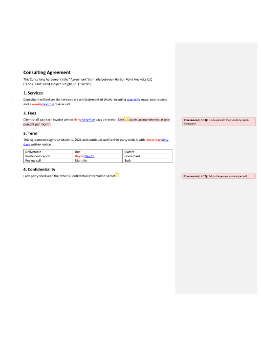
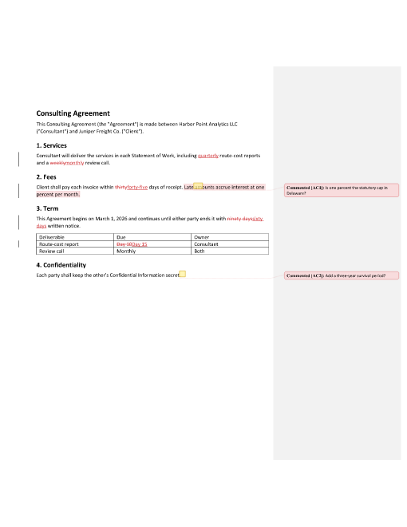
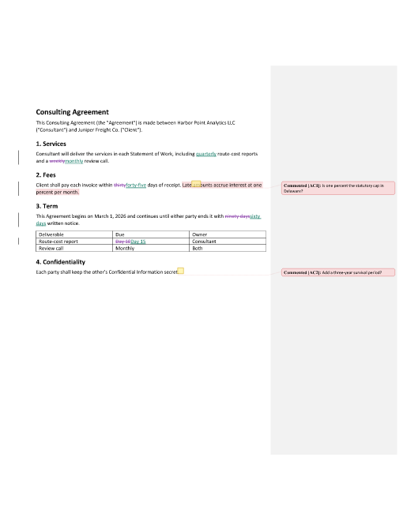
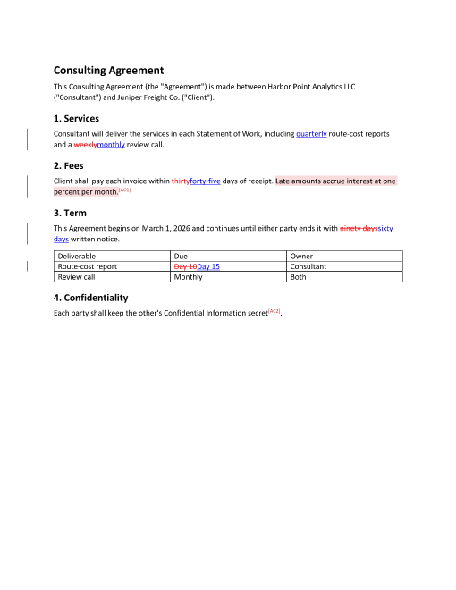
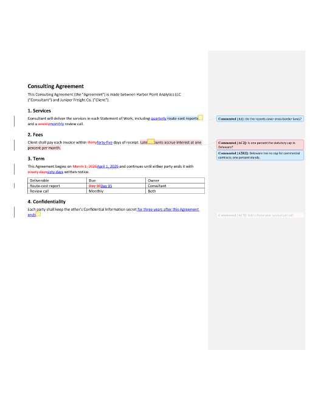
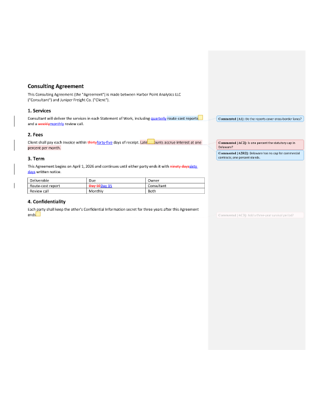
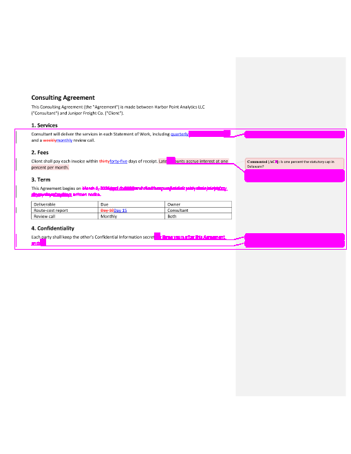
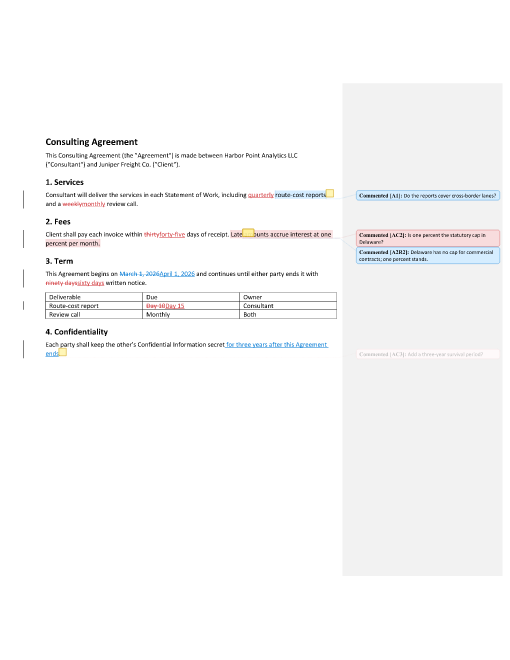
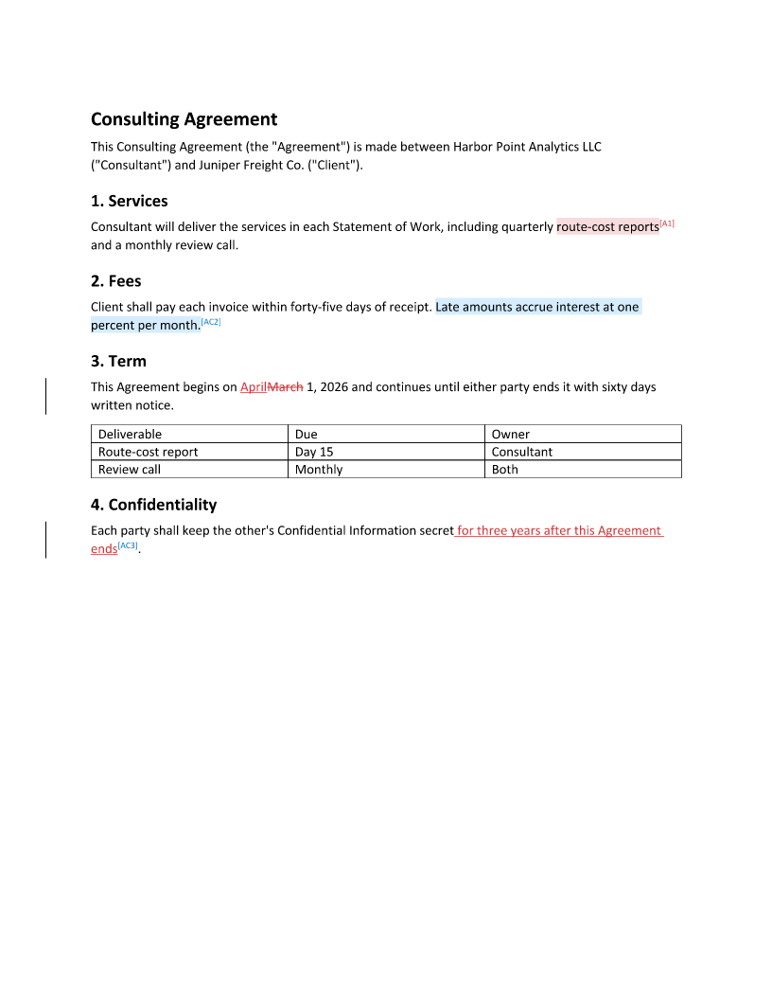

<!-- SPDX-FileCopyrightText: 2026 Jandira Technologies, LLC -->
<!-- SPDX-License-Identifier: AGPL-3.0-only -->

# How an agent sees documents with the jubarte CLI

Generated by `run.sh` from [`received.md`](received.md) and
[`plan.template.json`](plan.template.json); every block below is the real
output of the command above it. Do not edit by hand: rerun
`JUBARTE=path/to/jubarte bash examples/cli/visualize/run.sh`.
Every option of every command is listed in [`../help-cli.md`](../help-cli.md).

An agent has three kinds of eyes:

- **Text views** (`text`, `convert -t md`, `diff`, `changes`, `comments`,
  `inspect`): cheap, exact, greppable, and carry the IDs edit plans need.
- **Page views** (`convert --png`/`--pdf`, `edit --png`, `diff -o x.png`):
  what a person sees in Word, for layout, balloons and revision colours.
- **Machine views** (`--json` everywhere, `--report`, `diff-render --json`):
  for checking a result instead of reading it.

The document is a consulting agreement that Ann Counsel already redlined:
nine tracked changes (insertions, deletions, a table cell change) and two
comments, built from CriticMarkup:

```bash
jubarte convert received.md -o out/received.docx --author "Ann Counsel" --date 2026-10-01T09:00:00Z
```

Pages are rendered at 60 dpi to keep this folder small; read them at 96 dpi
or more.

## 1. Visualize a document

### 1.1 Read it as text

The edit view: Markdown with the `[body:p:N]` IDs an edit plan names. Revisions show as their current text.

```console
$ jubarte text out/received.docx
[body:p:0 Heading1] Consulting Agreement

[body:p:1] This Consulting Agreement (the "Agreement") is made between Harbor Point Analytics LLC ("Consultant") and Juniper Freight Co. ("Client").

[body:p:2 Heading2] 1. Services

[body:p:3] Consultant will deliver the services in each Statement of Work, including quarterly route-cost reports and a monthly review call.

[body:p:4 Heading2] 2. Fees

[body:p:5] Client shall pay each invoice within forty-five days of receipt. Late amounts accrue interest at one percent per month.

[body:p:6 Heading2] 3. Term

[body:p:7] This Agreement begins on March 1, 2026 and continues until either party ends it with sixty days written notice.

[body:p:8] Deliverable

[body:p:9] Due

[body:p:10] Owner

[body:p:11] Route-cost report

[body:p:12] Day 15

[body:p:13] Consultant

[body:p:14] Review call

[body:p:15] Monthly

[body:p:16] Both

[body:p:17 Heading2] 4. Confidentiality

[body:p:18] Each party shall keep the other's Confidential Information secret.
```

`--track-changes all`: the tracked changes and comments as CriticMarkup, with author and date.

```console
$ jubarte text out/received.docx --track-changes all
# Consulting Agreement

This Consulting Agreement (the "Agreement") is made between Harbor Point Analytics LLC ("Consultant") and Juniper Freight Co. ("Client").

## 1. Services

Consultant will deliver the services in each Statement of Work, including {++quarterly++}{>>Ann Counsel (2026-10-01T09:00:00Z)<<} route-cost reports and a {~~weekly~>monthly~~}{>>Ann Counsel (2026-10-01T09:00:00Z)<<} review call.

## 2. Fees

Client shall pay each invoice within {~~thirty~>forty-five~~}{>>Ann Counsel (2026-10-01T09:00:00Z)<<} days of receipt. {==Late amounts accrue interest at one percent per month.==}{>>Ann Counsel (2026-10-01T09:00:00Z): Is one percent the statutory cap in Delaware?<<}

## 3. Term

This Agreement begins on March 1, 2026 and continues until either party ends it with {~~ninety days~>sixty days~~}{>>Ann Counsel (2026-10-01T09:00:00Z)<<} written notice.

|Deliverable|Due|Owner|
|-|-|-|
|Route-cost report|{~~Day 10~>Day 15~~}{>>Ann Counsel (2026-10-01T09:00:00Z)<<}|Consultant|
|Review call|Monthly|Both|

## 4. Confidentiality

Each party shall keep the other's Confidential Information secret{>>Ann Counsel (2026-10-01T09:00:00Z): Add a three-year survival period?<<}.
```

`--track-changes accept`: the text as it reads once every change is accepted.

```console
$ jubarte text out/received.docx --track-changes accept
# Consulting Agreement

This Consulting Agreement (the "Agreement") is made between Harbor Point Analytics LLC ("Consultant") and Juniper Freight Co. ("Client").

## 1. Services

Consultant will deliver the services in each Statement of Work, including quarterly route-cost reports and a monthly review call.

## 2. Fees

Client shall pay each invoice within forty-five days of receipt. Late amounts accrue interest at one percent per month.

## 3. Term

This Agreement begins on March 1, 2026 and continues until either party ends it with sixty days written notice.

|Deliverable|Due|Owner|
|-|-|-|
|Route-cost report|Day 15|Consultant|
|Review call|Monthly|Both|

## 4. Confidentiality

Each party shall keep the other's Confidential Information secret.
```

`--track-changes reject`: the text as it read before the changes.

```console
$ jubarte text out/received.docx --track-changes reject
# Consulting Agreement

This Consulting Agreement (the "Agreement") is made between Harbor Point Analytics LLC ("Consultant") and Juniper Freight Co. ("Client").

## 1. Services

Consultant will deliver the services in each Statement of Work, including route-cost reports and a weekly review call.

## 2. Fees

Client shall pay each invoice within thirty days of receipt. Late amounts accrue interest at one percent per month.

## 3. Term

This Agreement begins on March 1, 2026 and continues until either party ends it with ninety days written notice.

|Deliverable|Due|Owner|
|-|-|-|
|Route-cost report|Day 10|Consultant|
|Review call|Monthly|Both|

## 4. Confidentiality

Each party shall keep the other's Confidential Information secret.
```

### 1.2 Read it as Markdown with pages

`convert -t md`: CriticMarkup plus `<!-- page N of M -->` lines from the layout, so an agent knows which page text lands on.

```console
$ jubarte convert out/received.docx -t md
<!-- page 1 of 1 -->

# Consulting Agreement

This Consulting Agreement (the "Agreement") is made between Harbor Point Analytics LLC ("Consultant") and Juniper Freight Co. ("Client").

## 1. Services

Consultant will deliver the services in each Statement of Work, including {++quarterly++}{>>Ann Counsel (2026-10-01T09:00:00Z)<<} route-cost reports and a {~~weekly~>monthly~~}{>>Ann Counsel (2026-10-01T09:00:00Z)<<} review call.

## 2. Fees

Client shall pay each invoice within {~~thirty~>forty-five~~}{>>Ann Counsel (2026-10-01T09:00:00Z)<<} days of receipt. {==Late amounts accrue interest at one percent per month.==}{>>Ann Counsel (2026-10-01T09:00:00Z): Is one percent the statutory cap in Delaware?<<}

## 3. Term

This Agreement begins on March 1, 2026 and continues until either party ends it with {~~ninety days~>sixty days~~}{>>Ann Counsel (2026-10-01T09:00:00Z)<<} written notice.

|Deliverable|Due|Owner|
|-|-|-|
|Route-cost report|{~~Day 10~>Day 15~~}{>>Ann Counsel (2026-10-01T09:00:00Z)<<}|Consultant|
|Review call|Monthly|Both|

## 4. Confidentiality

Each party shall keep the other's Confidential Information secret{>>Ann Counsel (2026-10-01T09:00:00Z): Add a three-year survival period?<<}.
```

`--no-page-markers` skips the layout pass; `--track-changes accept|reject` resolves the changes in the Markdown itself.

```console
$ jubarte convert out/received.docx -t md --no-page-markers --track-changes accept
# Consulting Agreement

This Consulting Agreement (the "Agreement") is made between Harbor Point Analytics LLC ("Consultant") and Juniper Freight Co. ("Client").

## 1. Services

Consultant will deliver the services in each Statement of Work, including quarterly route-cost reports and a monthly review call.

## 2. Fees

Client shall pay each invoice within forty-five days of receipt. Late amounts accrue interest at one percent per month.

## 3. Term

This Agreement begins on March 1, 2026 and continues until either party ends it with sixty days written notice.

|Deliverable|Due|Owner|
|-|-|-|
|Route-cost report|Day 15|Consultant|
|Review call|Monthly|Both|

## 4. Confidentiality

Each party shall keep the other's Confidential Information secret.
```

### 1.3 List what changed and who said what

`changes`: one line per tracked change, with the `body:rev:N` IDs that `accept`, `reject` and edit plans select.

```console
$ jubarte changes out/received.docx
body:rev:1	insertion	text	Ann Counsel	"quarterly"
body:rev:2	deletion	text	Ann Counsel	"weekly"
body:rev:3	insertion	text	Ann Counsel	"monthly"
body:rev:4	deletion	text	Ann Counsel	"thirty"
body:rev:5	insertion	text	Ann Counsel	"forty-five"
body:rev:6	deletion	text	Ann Counsel	"ninety days"
body:rev:7	insertion	text	Ann Counsel	"sixty days"
body:rev:8	deletion	text	Ann Counsel	"Day 10"
body:rev:9	insertion	text	Ann Counsel	"Day 15"
9 change(s)
```

`changes --json`: the same as JSON lines.

```console
$ jubarte changes out/received.docx --json
{"id":"body:rev:1","kind":"insertion","target":"text","author":"Ann Counsel","date":"2026-10-01T09:00:00Z","text":"quarterly"}
{"id":"body:rev:2","kind":"deletion","target":"text","author":"Ann Counsel","date":"2026-10-01T09:00:00Z","text":"weekly"}
{"id":"body:rev:3","kind":"insertion","target":"text","author":"Ann Counsel","date":"2026-10-01T09:00:00Z","text":"monthly"}
{"id":"body:rev:4","kind":"deletion","target":"text","author":"Ann Counsel","date":"2026-10-01T09:00:00Z","text":"thirty"}
{"id":"body:rev:5","kind":"insertion","target":"text","author":"Ann Counsel","date":"2026-10-01T09:00:00Z","text":"forty-five"}
{"id":"body:rev:6","kind":"deletion","target":"text","author":"Ann Counsel","date":"2026-10-01T09:00:00Z","text":"ninety days"}
{"id":"body:rev:7","kind":"insertion","target":"text","author":"Ann Counsel","date":"2026-10-01T09:00:00Z","text":"sixty days"}
{"id":"body:rev:8","kind":"deletion","target":"text","author":"Ann Counsel","date":"2026-10-01T09:00:00Z","text":"Day 10"}
{"id":"body:rev:9","kind":"insertion","target":"text","author":"Ann Counsel","date":"2026-10-01T09:00:00Z","text":"Day 15"}
```

`revisions`: the revision summary of a redline.

```console
$ jubarte revisions out/received.docx
Inserted	Ann Counsel	word/document.xml	"quarterly"
Deleted	Ann Counsel	word/document.xml	"weekly"
Inserted	Ann Counsel	word/document.xml	"monthly"
Deleted	Ann Counsel	word/document.xml	"thirty"
Inserted	Ann Counsel	word/document.xml	"forty-five"
Deleted	Ann Counsel	word/document.xml	"ninety days"
Inserted	Ann Counsel	word/document.xml	"sixty days"
Deleted	Ann Counsel	word/document.xml	"Day 10"
Inserted	Ann Counsel	word/document.xml	"Day 15"
9 revision(s)
```

`comments`: comments, their anchors, replies and resolved state. `--json`, `--author NAME` and `--latest` (newest per thread) narrow it.

```console
$ jubarte comments out/received.docx
0	body:p:5	Ann Counsel	"Is one percent the statutory cap in Delaware?"	on "Late amounts accrue interest at one perc"
1	body:p:18	Ann Counsel	"Add a three-year survival period?"	on ""
2 comment(s)
```


```console
$ jubarte comments out/received.docx --json --author Ann\ Counsel
{"id":0,"author":"Ann Counsel","initials":"AC","date":"2026-10-01T09:00:00Z","text":"Is one percent the statutory cap in Delaware?","done":false,"paragraph":"body:p:5","anchor_text":"Late amounts accrue interest at one percent per month.","before":"Client shall pay each invoice within forty-five days of receipt. ","after":""}
{"id":1,"author":"Ann Counsel","initials":"AC","date":"2026-10-01T09:00:00Z","text":"Add a three-year survival period?","done":false,"paragraph":"body:p:18","anchor_text":"","before":"Each party shall keep the other's Confidential Information secret","after":"."}
```

### 1.4 Inspect the structure

`inspect`: document facts, paragraph styles and tables.

```console
$ jubarte inspect out/received.docx
sha256: 569c088c60325538e72d5264acea8c548a3fde313cd0e678e069eebb08ffcd4a
paragraphs: 19  tables: 1  fields: 0  sections: 1  comments: 2  revisions: 9  footnotes: 0  endnotes: 0  headers: 0  footers: 0  images: 0  numbering: false  track_changes: false
body:p:0	[Heading1]	Consulting Agreement
body:p:1	[]	This Consulting Agreement (the "Agreement") is made between Harbor Point Analyti…
body:p:2	[Heading2]	1. Services
body:p:3	[revision]	Consultant will deliver the services in each Statement of Work, including quarte…
body:p:4	[Heading2]	2. Fees
body:p:5	[revision]	Client shall pay each invoice within forty-five days of receipt. Late amounts ac…
body:p:6	[Heading2]	3. Term
body:p:7	[revision]	This Agreement begins on March 1, 2026 and continues until either party ends it …
body:p:8	[table]	Deliverable
body:p:9	[table]	Due
body:p:10	[table]	Owner
body:p:11	[table]	Route-cost report
body:p:12	[table,revision]	Day 15
body:p:13	[table]	Consultant
body:p:14	[table]	Review call
body:p:15	[table]	Monthly
body:p:16	[table]	Both
body:p:17	[Heading2]	4. Confidentiality
body:p:18	[]	Each party shall keep the other's Confidential Information secret.
```

`inspect --tables`: each table as a grid, with cell IDs.

```console
$ jubarte inspect out/received.docx --tables
table 0: 3x3 header_rows=1 widths=3120,3120,3120
body:p:8=Deliverable	body:p:9=Due	body:p:10=Owner
body:p:11=Route-cost report	body:p:12=Day 15	body:p:13=Consultant
body:p:14=Review call	body:p:15=Monthly	body:p:16=Both
```

`inspect --json` writes the full snapshot (`schema_version`, `source_sha256`, `summary`, `paragraphs`, `stories`, `tables`): [`out/inspect.json`](out/inspect.json). Its `source_sha256` is the value an edit plan pins.

`debug --check render`: what each story should put on the page (tables, fonts and what replaces them, revisions, sections).

```console
$ jubarte debug out/received.docx --check render
(layout): 1 pages
  pages 1
  font "Calibri" bold → Calibri-Bold explicit
  font "Calibri" regular → Calibri explicit
  font "Times New Roman" bold → TimesNewRomanPS-BoldMT explicit
  docDefaults rfonts ascii=Calibri cs=Calibri eastAsia=Calibri hAnsi=Calibri
word/comments.xml: 2 paragraphs
  pstyle "annotation text" ×2
word/document.xml: 19 paragraphs
  table 1 3x3 style="Table Grid" "Deliverable | Due | Owner"
  section 1 page=12240x15840 margins=1440,1440,1440,1440 header=720 footer=720
  pstyle "heading 1" ×1
  pstyle "heading 2" ×4
  revisions del→ins ×4 "Consultant will deliver the services in …"
```

### 1.5 See the pages

`convert --png`: every page as PNG, with `--report` (page count, each page's text, fonts) and `--font-report` (how each requested font resolved).

```console
$ jubarte convert out/received.docx --png --dpi 60 -o out/received.pdf --report out/received-report.json --font-report out/received-fonts.json --force
wrote 1 PNG page (out/received-page-NN.png, 60 dpi)
```



Conventional marks (the default): deletions red and struck, insertions blue and underlined, moves green; comments in balloons on the right.

`--revisions word`: the markup Microsoft Word paints when it saves as PDF. Use it whenever the page is compared with one of Word's.

```console
$ jubarte convert out/received.docx --png --dpi 60 -o out/received-word.pdf --revisions word --force
wrote 1 PNG page (out/received-word-page-NN.png, 60 dpi)
```



`--revisions custom --revision-palette`: pick each kind's colour and line (`strike`, `double-strike`, `underline`, `double-underline`, `plain`).

```console
$ jubarte convert out/received.docx --png --dpi 60 -o out/received-custom.pdf --revisions custom --revision-palette deleted=#8E44AD:double-strike\,inserted=#117A65:double-underline --force
wrote 1 PNG page (out/received-custom-page-NN.png, 60 dpi)
```



`--move-comments`: comments listed after the last page; the commented text keeps its tint and a `[JR1]` marker, and the page keeps its own width.

```console
$ jubarte convert out/received.docx --png --dpi 60 -o out/received-endnotes.pdf --move-comments --force
wrote 2 PNG pages (out/received-endnotes-page-NN.png, 60 dpi)
```




`--pdf` (the default) writes the PDF; `--compress` deflates its streams. `--pages 1` rasterizes only page 1 (layout still covers the whole document); `--changed-only` keeps only pages a tracked change touches.

```console
$ jubarte convert out/received.docx --pdf --compress -o out/received-compressed.pdf --force
wrote out/received-compressed.pdf (55479 bytes, 1 page)
```


```console
$ jubarte convert out/received.docx --png --pages 1 --changed-only --dpi 60 -o out/received-changed.pdf --force
wrote 1 PNG page (out/received-changed-page-NN.png, 60 dpi)
```

### 1.6 Check it before trusting it

`validate`: will Word open it without a repair prompt? (findings: exit 2)

```console
$ jubarte validate out/received.docx
no findings
```

`audit`: accessibility, style and structure findings (findings: exit 2).

```console
$ jubarte audit out/received.docx
0 findings: 0 error, 0 warning, 0 info (9 rules, with layout)
```

## 2. Edit a document that already has tracked changes and comments

The agent answers Ann's comments and makes two edits of its own with an edit plan. `"existing_revisions": "keep"` keeps her nine changes as they are; the plan pins the `source_sha256` of `received.docx`, so it cannot be applied to another version of the file. The plan in this folder is [`plan.template.json`](plan.template.json) with that hash filled in.

`edit --dry-run`: resolve every operation and report, write nothing. A plan that cannot apply exits 3 with the reason.

```console
$ jubarte edit out/received.docx --plan out/plan.json --out-dir out/edited --dry-run
{"author":"Agent","base_sha256":"569c088c60325538e72d5264acea8c548a3fde313cd0e678e069eebb08ffcd4a","date":"2026-10-02T15:00:00Z","ev":"load","existing_revisions":"keep","guarded":true,"paras":19,"sha256":"569c088c60325538e72d5264acea8c548a3fde313cd0e678e069eebb08ffcd4a"}
{"at":"body:p:7","ctx":"Agreement begins on {March 1, 2026→April 1, 2026} and continues until","ev":"op","i":1,"id":"start-date","matches":1,"op":"replace","status":"ok"}
{"at":"body:p:18","ctx":"l Information secret{+ for three years after this Agreement ends}.","ev":"op","i":2,"id":"survival","matches":1,"op":"insert","status":"ok"}
{"at":"body:p:5","ctx":"comment 0","ev":"op","i":3,"id":"answer-cap","matches":1,"op":"reply_comment","status":"ok"}
{"at":"body:p:18","comment_id":1,"ctx":"comment 1","ev":"op","i":4,"id":"resolve-survival","matches":1,"op":"resolve_comment","status":"ok"}
{"at":"body:p:3","ctx":"including quarterly {#route-cost reports} and a monthly revie","ev":"op","i":5,"id":"ask-scope","matches":1,"op":"comment","status":"ok"}
{"comments":{"added":0},"ev":"summary","ops":{"failed":0,"ok":5},"paras":{"d":0,"from":19,"to":19},"revs":{"deleted":0,"format_changed":0,"inserted":0,"moved":0,"total":0},"status":"ok"}
```

`edit --pdf --png`: write `clean.docx` (every change accepted), `redline.docx` (Ann's changes plus the agent's), `patch.diff`, `report.jsonl`, and both as PDF and PNG.

```console
$ jubarte edit out/received.docx --plan out/plan.json --out-dir out/edited --pdf --png --dpi 60
{"comments":{"added":2},"ev":"summary","ops":{"failed":0,"ok":5},"paras":{"d":0,"from":19,"to":19},"revs":{"deleted":1,"format_changed":0,"inserted":2,"moved":0,"total":3},"status":"ok"}
wrote out/edited (8 files: clean.docx, redline.docx, patch.diff, report.jsonl, …)
--- a/received.docx
+++ b/received.docx	Agent	2026-10-02T15:00:00Z
@@ [body:p:3] @@
Consultant will deliver the services in each Statement of Work,
including quarterly {==route-cost reports==}{>>Agent
(2026-10-02T15:00:00Z): Do the reports cover cross-border lanes?<<} and
a monthly review call.

@@ [body:p:5] @@
Client shall pay each invoice within forty-five days of receipt. {==Late
amounts accrue interest at one percent per month.==}{>>Ann Counsel
(2026-10-01T09:00:00Z): Is one percent the statutory cap in
Delaware?<<}{>>Agent (2026-10-02T15:00:00Z): Delaware has no cap for
commercial contracts; one percent stands.<<}

@@ [body:p:7] @@
This Agreement begins on [-March 1, 2026-]{+April 1, 2026+} and
continues until either party ends it with sixty days written notice.

@@ [body:p:18] @@
Each party shall keep the other's Confidential Information secret{+ for
three years after this Agreement ends+}{>>Ann Counsel
(2026-10-01T09:00:00Z): Add a three-year survival period?<<}.
```





### 2.1 What the edit did, as text

`patch.diff`: only the paragraphs the plan touched, as `git diff --word-diff` with CriticMarkup comments:

```diff
--- a/received.docx
+++ b/received.docx	Agent	2026-10-02T15:00:00Z
@@ [body:p:3] @@
Consultant will deliver the services in each Statement of Work,
including quarterly {==route-cost reports==}{>>Agent
(2026-10-02T15:00:00Z): Do the reports cover cross-border lanes?<<} and
a monthly review call.

@@ [body:p:5] @@
Client shall pay each invoice within forty-five days of receipt. {==Late
amounts accrue interest at one percent per month.==}{>>Ann Counsel
(2026-10-01T09:00:00Z): Is one percent the statutory cap in
Delaware?<<}{>>Agent (2026-10-02T15:00:00Z): Delaware has no cap for
commercial contracts; one percent stands.<<}

@@ [body:p:7] @@
This Agreement begins on [-March 1, 2026-]{+April 1, 2026+} and
continues until either party ends it with sixty days written notice.

@@ [body:p:18] @@
Each party shall keep the other's Confidential Information secret{+ for
three years after this Agreement ends+}{>>Ann Counsel
(2026-10-01T09:00:00Z): Add a three-year survival period?<<}.
```

`report.jsonl`: one line per operation, then a summary (`status`, operations ok/failed, revisions and comments added):

```json
{"author":"Agent","base_sha256":"569c088c60325538e72d5264acea8c548a3fde313cd0e678e069eebb08ffcd4a","date":"2026-10-02T15:00:00Z","ev":"load","existing_revisions":"keep","guarded":true,"paras":19,"sha256":"569c088c60325538e72d5264acea8c548a3fde313cd0e678e069eebb08ffcd4a"}
{"at":"body:p:7","ctx":"Agreement begins on {March 1, 2026→April 1, 2026} and continues until","ev":"op","i":1,"id":"start-date","matches":1,"op":"replace","status":"ok"}
{"at":"body:p:18","ctx":"l Information secret{+ for three years after this Agreement ends}.","ev":"op","i":2,"id":"survival","matches":1,"op":"insert","status":"ok"}
{"at":"body:p:5","comment_id":2,"ctx":"comment 0","ev":"op","i":3,"id":"answer-cap","matches":1,"op":"reply_comment","status":"ok"}
{"at":"body:p:18","comment_id":1,"ctx":"comment 1","ev":"op","i":4,"id":"resolve-survival","matches":1,"op":"resolve_comment","status":"ok"}
{"at":"body:p:3","comment_id":3,"ctx":"including quarterly {#route-cost reports} and a monthly revie","ev":"op","i":5,"id":"ask-scope","matches":1,"op":"comment","status":"ok"}
{"engine":"jubarte 0.11.3","ev":"render","page_starts":{"clean":["Consulting Agreement"],"redline":["Consulting Agreement"]},"pages":{"clean":1,"redline":1}}
{"dir":"out/edited","ev":"save","outputs":[{"bytes":7546,"f":"clean.docx","sha256":"a235d698e2fdb9e2381a9f9a8751d67222b9d5c5799ed86c2136f94ac501f101"},{"bytes":7621,"f":"redline.docx","sha256":"363bb06c2fb1eac22296a408ad46a2136157732dc823a4b91afd5b0555a32ee1"},{"bytes":986,"f":"patch.diff","sha256":"e840d511381828672456fdc6432fbeca784f7756103af5839241d1f735e3374f"},{"bytes":60647,"f":"redline.pdf","sha256":"6501b46a7173c740caf5b4a2f0012de7a77ec785de8acfbefc2223544a318f73"},{"bytes":25020,"f":"redline-page-01.png","sha256":"118608aa567bcf23ddf1ed6b4274e56f11b663cda36c2d7505009258beecf329"},{"bytes":60453,"f":"clean.pdf","sha256":"5ca76626bc62be5b365006499d9745d3c31a0f309f521ec93f2cfe19fa243702"},{"bytes":24657,"f":"clean-page-01.png","sha256":"aeb514e7e8b73a8b312ffbe76661b5091e828a697bb76a8343405e215c1670d5"}]}
{"comments":{"added":2},"ev":"summary","ops":{"failed":0,"ok":5},"paras":{"d":0,"from":19,"to":19},"revs":{"deleted":1,"format_changed":0,"inserted":2,"moved":0,"total":3},"status":"ok"}
```

`changes` on the redline: the agent's revisions sit beside Ann's, each with its author.

```console
$ jubarte changes out/edited/redline.docx
body:rev:1	insertion	text	Ann Counsel	"quarterly"
body:rev:2	deletion	text	Ann Counsel	"weekly"
body:rev:3	insertion	text	Ann Counsel	"monthly"
body:rev:4	deletion	text	Ann Counsel	"thirty"
body:rev:5	insertion	text	Ann Counsel	"forty-five"
body:rev:10	deletion	text	Agent	"March 1, 2026"
body:rev:11	insertion	text	Agent	"April 1, 2026"
body:rev:6	deletion	text	Ann Counsel	"ninety days"
body:rev:7	insertion	text	Ann Counsel	"sixty days"
body:rev:8	deletion	text	Ann Counsel	"Day 10"
body:rev:9	insertion	text	Ann Counsel	"Day 15"
body:rev:12	insertion	text	Agent	" for three years after this Agreement ends"
12 change(s)
```

`comments` on the redline: the reply names its parent and the resolved comment says so.

```console
$ jubarte comments out/edited/redline.docx
0	body:p:5	Ann Counsel	"Is one percent the statutory cap in Delaware?"	on "Late amounts accrue interest at one perc"
2	body:p:5	Agent	"Delaware has no cap for commercial contracts; one percent st"	on "Late amounts accrue interest at one perc"	reply to 0
1	body:p:18	Ann Counsel	"Add a three-year survival period?"	on ""	resolved
3	body:p:3	Agent	"Do the reports cover cross-border lanes?"	on "route-cost reports"
4 comment(s)
```

`comments --latest`: one comment per thread, the newest.

```console
$ jubarte comments out/edited/redline.docx --latest
2	body:p:5	Agent	"Delaware has no cap for commercial contracts; one percent st"	on "Late amounts accrue interest at one perc"	reply to 0
1	body:p:18	Ann Counsel	"Add a three-year survival period?"	on ""	resolved
3	body:p:3	Agent	"Do the reports cover cross-border lanes?"	on "route-cost reports"
3 comment(s)
```

`text --track-changes all` on the redline: the whole document with every change and comment.

```console
$ jubarte text out/edited/redline.docx --track-changes all
# Consulting Agreement

This Consulting Agreement (the "Agreement") is made between Harbor Point Analytics LLC ("Consultant") and Juniper Freight Co. ("Client").

## 1. Services

Consultant will deliver the services in each Statement of Work, including {++quarterly++}{>>Ann Counsel (2026-10-01T09:00:00Z)<<} {==route-cost reports==}{>>Agent (2026-10-02T15:00:00Z): Do the reports cover cross-border lanes?<<} and a {~~weekly~>monthly~~}{>>Ann Counsel (2026-10-01T09:00:00Z)<<} review call.

## 2. Fees

Client shall pay each invoice within {~~thirty~>forty-five~~}{>>Ann Counsel (2026-10-01T09:00:00Z)<<} days of receipt. {==Late amounts accrue interest at one percent per month.==}{>>Ann Counsel (2026-10-01T09:00:00Z): Is one percent the statutory cap in Delaware?<<}{>>Agent (2026-10-02T15:00:00Z): Delaware has no cap for commercial contracts; one percent stands.<<}

## 3. Term

This Agreement begins on {~~March 1, 2026~>April 1, 2026~~}{>>Agent (2026-10-02T15:00:00Z)<<} and continues until either party ends it with {~~ninety days~>sixty days~~}{>>Ann Counsel (2026-10-01T09:00:00Z)<<} written notice.

|Deliverable|Due|Owner|
|-|-|-|
|Route-cost report|{~~Day 10~>Day 15~~}{>>Ann Counsel (2026-10-01T09:00:00Z)<<}|Consultant|
|Review call|Monthly|Both|

## 4. Confidentiality

Each party shall keep the other's Confidential Information secret{++ for three years after this Agreement ends++}{>>Agent (2026-10-02T15:00:00Z)<<}{>>Ann Counsel (2026-10-01T09:00:00Z): Add a three-year survival period?<<}.
```

### 2.2 What the edit did, as pages

`diff-render`: which rendered pages moved, and where (different pages: exit 5). With `--out-dir`, each changed page is written as before, after and a magenta overlay.

```console
$ jubarte diff-render out/received.docx out/edited/redline.docx --out-dir out/diff-render --dpi 60 --force
page 1: 3.20% of pixels changed, box [23, 189, 501, 360]
1 of 1 page differ (wrote out/diff-render)
[exit 5]
```



`diff-render --json`: the same answer for a script (`changed_ratio`, `bbox`, `only_in`).

```console
$ jubarte diff-render out/received.docx out/edited/redline.docx --json --dpi 60
{"a":"out/received.docx","b":"out/edited/redline.docx","dpi":60.0,"a_pages":1,"b_pages":1,"changed":1,"pages":[{"index":0,"changed_ratio":0.03195187,"bbox":[23,189,501,360]}]}
[exit 5]
```

`edit --revisions word`: the same plan, its redline painted as Word paints it.

```console
$ jubarte edit out/received.docx --plan out/plan.json --out-dir out/edited-word --png --dpi 60 --revisions word
{"comments":{"added":2},"ev":"summary","ops":{"failed":0,"ok":5},"paras":{"d":0,"from":19,"to":19},"revs":{"deleted":1,"format_changed":0,"inserted":2,"moved":0,"total":3},"status":"ok"}
wrote out/edited-word (6 files: clean.docx, redline.docx, patch.diff, report.jsonl, …)
--- a/received.docx
+++ b/received.docx	Agent	2026-10-02T15:00:00Z
@@ [body:p:3] @@
Consultant will deliver the services in each Statement of Work,
including quarterly {==route-cost reports==}{>>Agent
(2026-10-02T15:00:00Z): Do the reports cover cross-border lanes?<<} and
a monthly review call.

@@ [body:p:5] @@
Client shall pay each invoice within forty-five days of receipt. {==Late
amounts accrue interest at one percent per month.==}{>>Ann Counsel
(2026-10-01T09:00:00Z): Is one percent the statutory cap in
Delaware?<<}{>>Agent (2026-10-02T15:00:00Z): Delaware has no cap for
commercial contracts; one percent stands.<<}

@@ [body:p:7] @@
This Agreement begins on [-March 1, 2026-]{+April 1, 2026+} and
continues until either party ends it with sixty days written notice.

@@ [body:p:18] @@
Each party shall keep the other's Confidential Information secret{+ for
three years after this Agreement ends+}{>>Ann Counsel
(2026-10-01T09:00:00Z): Add a three-year survival period?<<}.
```



## 3. Diff two documents

Old is `received.docx`, new is the agent's `redline.docx`. Each view keeps both documents' tracked marks unless it says otherwise. `-a` and `-d` pin the author and date so this guide is reproducible; by default they are `git config user.name` and now.

### 3.1 Text views

`--format patch` (the default): the changed paragraphs as `git diff --word-diff` with CriticMarkup comments and highlights. `--columns N` wraps it (0: no wrap).

```console
$ jubarte diff out/received.docx out/edited/redline.docx -a Agent -d 2026-10-02T15:00:00Z
wrote out/received_v_redline.docx (11720 bytes)
--- a/out/received.docx
+++ b/out/edited/redline.docx	Agent	2026-10-02T15:00:00Z
@@ [body:p:3] @@
Consultant will deliver the services in each Statement of Work,
including quarterly {==route-cost reports==}{>>Agent
(2026-10-02T15:00:00Z): Do the reports cover cross-border lanes?<<} and
a monthly review call.

@@ [body:p:5] @@
Client shall pay each invoice within forty-five days of receipt. {==Late
amounts accrue interest at one percent per month.==}{>>Ann Counsel
(2026-10-01T09:00:00Z): Is one percent the statutory cap in
Delaware?<<}{>>Agent (2026-10-02T15:00:00Z): Delaware has no cap for
commercial contracts; one percent stands.<<}

@@ [body:p:7] @@
This Agreement begins on [-March-]{+April+} 1, 2026 and continues until
either party ends it with sixty days written notice.

@@ [body:p:18] @@
Each party shall keep the other's Confidential Information secret{+ for
three years after this Agreement ends+}{>>Ann Counsel
(2026-10-01T09:00:00Z): Add a three-year survival period?<<}.
```

With a Word document on either side, `patch` and `critic` also write a Word redline (`<old>_v_<new>.docx` beside the old document unless `-o` names another path), so the next run needs `--force`.

`--format critic`: the whole new document as CriticMarkup.

```console
$ jubarte diff out/received.docx out/edited/redline.docx --format critic --force -a Agent -d 2026-10-02T15:00:00Z
wrote out/received_v_redline.docx (11720 bytes)
```

`--format github`: a Git/GitHub unified diff of the two documents' text, tracked marks preserved; `-U N` sets the context lines.

```console
$ jubarte diff out/received.docx out/edited/redline.docx --format github
diff --git a/out/received.docx b/out/edited/redline.docx
--- a/out/received.docx
+++ b/out/edited/redline.docx
@@ -2,11 +2,11 @@
   ¶  Consulting Agreement
   ¶  This Consulting Agreement (the "Agreement") is made between Harbo…
   ¶  1. Services
-… {++quarterly++} route-cost reports and a {--weekly--}{++monthly++} re…
+… {++quarterly++} route-cost reports[c3] and a {--weekly--}{++monthly++…
   ¶  2. Fees
-…erest at one percent per month.[c0]
+…erest at one percent per month.[c0][c2]
   ¶  3. Term
-  ¶  This Agreement begins on March 1, 2026 and continues until either…
+  ¶  This Agreement begins on {--March 1, 2026--}{++April 1, 2026++} a…
   table
    row
     ¶  Deliverable
@@ -21,7 +21,9 @@
     ¶  Monthly
     ¶  Both
   ¶  4. Confidentiality
-…r's Confidential Information secret[c1].
+…r's Confidential Information secret{++ for three years after this Agre…
 [word/comments.xml]
   ¶  Is one percent the statutory cap in Delaware?
+  ¶  Delaware has no cap for commercial contracts; one percent stands.
   ¶  Add a three-year survival period?
+  ¶  Do the reports cover cross-border lanes?
```

`-U0`: changed lines only.

```console
$ jubarte diff out/received.docx out/edited/redline.docx --format github -U0
diff --git a/out/received.docx b/out/edited/redline.docx
--- a/out/received.docx
+++ b/out/edited/redline.docx
@@ -5 +5 @@
-… {++quarterly++} route-cost reports and a {--weekly--}{++monthly++} re…
+… {++quarterly++} route-cost reports[c3] and a {--weekly--}{++monthly++…
@@ -7 +7 @@
-…erest at one percent per month.[c0]
+…erest at one percent per month.[c0][c2]
@@ -9 +9 @@
-  ¶  This Agreement begins on March 1, 2026 and continues until either…
+  ¶  This Agreement begins on {--March 1, 2026--}{++April 1, 2026++} a…
@@ -24 +24 @@
-…r's Confidential Information secret[c1].
+…r's Confidential Information secret{++ for three years after this Agre…
@@ -26,0 +27 @@
+  ¶  Delaware has no cap for commercial contracts; one percent stands.
@@ -27,0 +29 @@
+  ¶  Do the reports cover cross-border lanes?
```

`--accept-changes`: accept both documents' changes first, so only the outcome differs.

```console
$ jubarte diff out/received.docx out/edited/redline.docx --format github --accept-changes
diff --git a/out/received.docx b/out/edited/redline.docx
--- a/out/received.docx
+++ b/out/edited/redline.docx
@@ -2,11 +2,11 @@
   ¶  Consulting Agreement
   ¶  This Consulting Agreement (the "Agreement") is made between Harbo…
   ¶  1. Services
-…luding quarterly route-cost reports and a monthly review call.
+…luding quarterly route-cost reports[c3] and a monthly review call.
   ¶  2. Fees
-…erest at one percent per month.[c0]
+…erest at one percent per month.[c0][c2]
   ¶  3. Term
-  ¶  This Agreement begins on March 1, 2026 and continues until either…
+  ¶  This Agreement begins on April 1, 2026 and continues until either…
   table
    row
     ¶  Deliverable
@@ -21,7 +21,9 @@
     ¶  Monthly
     ¶  Both
   ¶  4. Confidentiality
-…r's Confidential Information secret[c1].
+…r's Confidential Information secret for three years after this Agreeme…
 [word/comments.xml]
   ¶  Is one percent the statutory cap in Delaware?
+  ¶  Delaware has no cap for commercial contracts; one percent stands.
   ¶  Add a three-year survival period?
+  ¶  Do the reports cover cross-border lanes?
```

`--format word`: fresh word-level CriticMarkup after accepting ALL changes in both documents.

```console
$ jubarte diff out/received.docx out/edited/redline.docx --format word
…luding quarterly route-cost reports{++[c3]++} and a monthly review call.
…erest at one percent per month.[c0]{++[c2]++}
  ¶  This Agreement begins on {~~March~>April~~} 1, 2026 and continues until e…
…r's Confidential Information secret{++ for three years after this Agreeme…++}…
{++  ¶  Delaware has no cap for commercial contracts; one percent stands.++}
{++  ¶  Do the reports cover cross-border lanes?++}
```

`--format normal`: line addresses (`a`/`d`/`c`), `<` and `>` lines, no context.

```console
$ jubarte diff out/received.docx out/edited/redline.docx --format normal
5c5
< … {++quarterly++} route-cost reports and a {--weekly--}{++monthly++} re…
---
> … {++quarterly++} route-cost reports[c3] and a {--weekly--}{++monthly++…
7c7
< …erest at one percent per month.[c0]
---
> …erest at one percent per month.[c0][c2]
9c9
<   ¶  This Agreement begins on March 1, 2026 and continues until either…
---
>   ¶  This Agreement begins on {--March 1, 2026--}{++April 1, 2026++} a…
24c24
< …r's Confidential Information secret[c1].
---
> …r's Confidential Information secret{++ for three years after this Agre…
26a27
>   ¶  Delaware has no cap for commercial contracts; one percent stands.
27a29
>   ¶  Do the reports cover cross-border lanes?
```

`--format context`: old/new range blocks with `!`, `+` and `-` prefixes.

```console
$ jubarte diff out/received.docx out/edited/redline.docx --format context
*** out/received.docx
--- out/edited/redline.docx
***************
*** 2,12 ****
    ¶  Consulting Agreement
    ¶  This Consulting Agreement (the "Agreement") is made between Harbo…
    ¶  1. Services
! … {++quarterly++} route-cost reports and a {--weekly--}{++monthly++} re…
    ¶  2. Fees
! …erest at one percent per month.[c0]
    ¶  3. Term
!   ¶  This Agreement begins on March 1, 2026 and continues until either…
    table
     row
      ¶  Deliverable
--- 2,12 ----
    ¶  Consulting Agreement
    ¶  This Consulting Agreement (the "Agreement") is made between Harbo…
    ¶  1. Services
! … {++quarterly++} route-cost reports[c3] and a {--weekly--}{++monthly++…
    ¶  2. Fees
! …erest at one percent per month.[c0][c2]
    ¶  3. Term
!   ¶  This Agreement begins on {--March 1, 2026--}{++April 1, 2026++} a…
    table
     row
      ¶  Deliverable
***************
*** 21,27 ****
      ¶  Monthly
      ¶  Both
    ¶  4. Confidentiality
! …r's Confidential Information secret[c1].
  [word/comments.xml]
    ¶  Is one percent the statutory cap in Delaware?
    ¶  Add a three-year survival period?
--- 21,29 ----
      ¶  Monthly
      ¶  Both
    ¶  4. Confidentiality
… (6 more lines)
```

`--format side-by-side`: old and new in columns with `|`, `<` and `>` markers. Lines are cut to a 70-character window around the change; `--full-lines` shows them whole.

```console
$ jubarte diff out/received.docx out/edited/redline.docx --format side-by-side
  ¶  Consulting Agreement                                                    ¶  Consulting Agreement
  ¶  This Consulting Agreement (the "Agreement") is made between Harbo…      ¶  This Consulting Agreement (the "Agreement") is made between Harbo…
  ¶  1. Services                                                             ¶  1. Services
… {++quarterly++} route-cost reports and a {--weekly--}{++monthly++} re… | … {++quarterly++} route-cost reports[c3] and a {--weekly--}{++monthly++…
  ¶  2. Fees                                                                 ¶  2. Fees
…erest at one percent per month.[c0]                                     | …erest at one percent per month.[c0][c2]
  ¶  3. Term                                                                 ¶  3. Term
  ¶  This Agreement begins on March 1, 2026 and continues until either…  |   ¶  This Agreement begins on {--March 1, 2026--}{++April 1, 2026++} a…
  table                                                                      table
   row                                                                        row
    ¶  Deliverable                                                             ¶  Deliverable
    ¶  Monthly                                                                 ¶  Monthly
    ¶  Both                                                                    ¶  Both
  ¶  4. Confidentiality                                                      ¶  4. Confidentiality
…r's Confidential Information secret[c1].                                | …r's Confidential Information secret{++ for three years after this Agre…
[word/comments.xml]                                                        [word/comments.xml]
  ¶  Is one percent the statutory cap in Delaware?                           ¶  Is one percent the statutory cap in Delaware?
                                                                         >   ¶  Delaware has no cap for commercial contracts; one percent stands.
  ¶  Add a three-year survival period?                                       ¶  Add a three-year survival period?
                                                                         >   ¶  Do the reports cover cross-border lanes?
```


```console
$ jubarte diff out/received.docx out/edited/redline.docx --format side-by-side --full-lines -U0
  ¶  Consultant will deliver the services in each Statement of Work, including {++quarterly++} route-cost reports and a {--weekly--}{++monthly++} review call. |   ¶  Consultant will deliver the services in each Statement of Work, including {++quarterly++} route-cost reports[c3] and a {--weekly--}{++monthly++} review call.
  ¶  Client shall pay each invoice within {--thirty--}{++forty-five++} days of receipt. Late amounts accrue interest at one percent per month.[c0] |   ¶  Client shall pay each invoice within {--thirty--}{++forty-five++} days of receipt. Late amounts accrue interest at one percent per month.[c0][c2]
  ¶  This Agreement begins on March 1, 2026 and continues until either party ends it with {--ninety days--}{++sixty days++} written notice. |   ¶  This Agreement begins on {--March 1, 2026--}{++April 1, 2026++} and continues until either party ends it with {--ninety days--}{++sixty days++} written notice.
  ¶  Each party shall keep the other's Confidential Information secret[c1]. |   ¶  Each party shall keep the other's Confidential Information secret{++ for three years after this Agreement ends++}[c1].
                                                                         >   ¶  Delaware has no cap for commercial contracts; one percent stands.
                                                                         >   ¶  Do the reports cover cross-border lanes?
```

### 3.2 Word, PDF and page views

`diff -o x.docx` (or `compare`): a Word redline of old against new, every difference a tracked change by `--author`.

```console
$ jubarte diff out/received.docx out/edited/redline.docx -o out/diff.docx --force -a Agent -d 2026-10-02T15:00:00Z
wrote out/diff.docx (11720 bytes)
--- a/out/received.docx
+++ b/out/edited/redline.docx	Agent	2026-10-02T15:00:00Z
@@ [body:p:3] @@
Consultant will deliver the services in each Statement of Work,
including quarterly {==route-cost reports==}{>>Agent
(2026-10-02T15:00:00Z): Do the reports cover cross-border lanes?<<} and
a monthly review call.

@@ [body:p:5] @@
Client shall pay each invoice within forty-five days of receipt. {==Late
amounts accrue interest at one percent per month.==}{>>Ann Counsel
(2026-10-01T09:00:00Z): Is one percent the statutory cap in
Delaware?<<}{>>Agent (2026-10-02T15:00:00Z): Delaware has no cap for
commercial contracts; one percent stands.<<}

@@ [body:p:7] @@
This Agreement begins on [-March-]{+April+} 1, 2026 and continues until
either party ends it with sixty days written notice.

@@ [body:p:18] @@
Each party shall keep the other's Confidential Information secret{+ for
three years after this Agreement ends+}{>>Ann Counsel
(2026-10-01T09:00:00Z): Add a three-year survival period?<<}.
```


```console
$ jubarte compare out/received.docx out/edited/redline.docx -o out/compare.docx --force -a Agent -d 2026-10-02T15:00:00Z
wrote out/compare.docx (11720 bytes)
```

`compare --mode powertools`: Open-Xml-PowerTools' coarser paragraph-level redline instead of Word's.

```console
$ jubarte compare out/received.docx out/edited/redline.docx -o out/compare-powertools.docx --mode powertools --force -a Agent -d 2026-10-02T15:00:00Z
wrote out/compare-powertools.docx (8366 bytes)
```

`changes` on the comparison: what Compare marked.

```console
$ jubarte changes out/compare.docx
body:rev:4	insertion	text	Agent	"April"
body:rev:5	deletion	text	Agent	"March"
body:rev:6	formatting	properties	Agent	""
body:rev:7	formatting	properties	-	""
body:rev:8	insertion	text	Agent	" for three years after this Agreement ends"
5 change(s)
```

`diff -o x.png`: the redline's pages, with every `convert` page option: `--revisions`, `--revision-palette`, `--move-comments`, `--changed-only`.

```console
$ jubarte diff out/received.docx out/edited/redline.docx -o out/diff.png --force --revisions word --move-comments -a Agent -d 2026-10-02T15:00:00Z
wrote 2 PNG pages (out/diff-page-NN.png, 96 dpi)
--- a/out/received.docx
+++ b/out/edited/redline.docx	Agent	2026-10-02T15:00:00Z
@@ [body:p:3] @@
Consultant will deliver the services in each Statement of Work,
including quarterly {==route-cost reports==}{>>Agent
(2026-10-02T15:00:00Z): Do the reports cover cross-border lanes?<<} and
a monthly review call.

@@ [body:p:5] @@
Client shall pay each invoice within forty-five days of receipt. {==Late
amounts accrue interest at one percent per month.==}{>>Ann Counsel
(2026-10-01T09:00:00Z): Is one percent the statutory cap in
Delaware?<<}{>>Agent (2026-10-02T15:00:00Z): Delaware has no cap for
commercial contracts; one percent stands.<<}

@@ [body:p:7] @@
This Agreement begins on [-March-]{+April+} 1, 2026 and continues until
either party ends it with sixty days written notice.

@@ [body:p:18] @@
Each party shall keep the other's Confidential Information secret{+ for
three years after this Agreement ends+}{>>Ann Counsel
(2026-10-01T09:00:00Z): Add a three-year survival period?<<}.
```



`diff -o x.pdf --changed-only`: only the pages a change touches.

```console
$ jubarte diff out/received.docx out/edited/redline.docx -o out/diff-changed.pdf --force --changed-only -a Agent -d 2026-10-02T15:00:00Z
wrote out/diff-changed.pdf (169872 bytes, 1 page)
--- a/out/received.docx
+++ b/out/edited/redline.docx	Agent	2026-10-02T15:00:00Z
@@ [body:p:3] @@
Consultant will deliver the services in each Statement of Work,
including quarterly {==route-cost reports==}{>>Agent
(2026-10-02T15:00:00Z): Do the reports cover cross-border lanes?<<} and
a monthly review call.

@@ [body:p:5] @@
Client shall pay each invoice within forty-five days of receipt. {==Late
amounts accrue interest at one percent per month.==}{>>Ann Counsel
(2026-10-01T09:00:00Z): Is one percent the statutory cap in
Delaware?<<}{>>Agent (2026-10-02T15:00:00Z): Delaware has no cap for
commercial contracts; one percent stands.<<}

@@ [body:p:7] @@
This Agreement begins on [-March-]{+April+} 1, 2026 and continues until
either party ends it with sixty days written notice.

@@ [body:p:18] @@
Each party shall keep the other's Confidential Information secret{+ for
three years after this Agreement ends+}{>>Ann Counsel
(2026-10-01T09:00:00Z): Add a three-year survival period?<<}.
```

`debug A B --check text`: the two packages' paragraphs, only the lines that differ, with `{+inserted+}` and `[-deleted-]` runs.

```console
$ jubarte debug out/received.docx out/edited/redline.docx --check text
word/comments.xml: 2 lines differ
+B   ¶  Delaware has no cap for commercial contracts; one percent stands.
  ~
+B   ¶  Do the reports cover cross-border lanes?
word/document.xml: 4 lines differ
-A   ¶  Consultant will deliver the services in each Statement of Work, including {+quarterly+} route-cost reports and a [-weekly-]{+monthly+} review call.
+B   ¶  Consultant will deliver the services in each Statement of Work, including {+quarterly+} route-cost reports[c3] and a [-weekly-]{+monthly+} review call.
  ~
-A   ¶  Client shall pay each invoice within [-thirty-]{+forty-five+} days of receipt. Late amounts accrue interest at one percent per month.[c0]
+B   ¶  Client shall pay each invoice within [-thirty-]{+forty-five+} days of receipt. Late amounts accrue interest at one percent per month.[c0][c2]
  ~
-A   ¶  This Agreement begins on March 1, 2026 and continues until either party ends it with [-ninety days-]{+sixty days+} written notice.
+B   ¶  This Agreement begins on [-March 1, 2026-]{+April 1, 2026+} and continues until either party ends it with [-ninety days-]{+sixty days+} written notice.
  ~
-A   ¶  Each party shall keep the other's Confidential Information secret[c1].
+B   ¶  Each party shall keep the other's Confidential Information secret{+ for three years after this Agreement ends+}[c1].
```

### 3.3 Markdown on either side

The same views work on Markdown. Here the agent's version of the Markdown source is compared with Ann's; `--critic` reads the CriticMarkup as tracked changes instead of text.


```console
$ jubarte diff received.md out/agent.md --format github -U1
diff --git a/received.md b/out/agent.md
--- a/received.md
+++ b/out/agent.md
@@ -17,3 +17,3 @@
 
-This Agreement begins on March 1, 2026 and continues until either part…
+This Agreement begins on April 1, 2026 and continues until either part…
 it with {--ninety days--}{++sixty days++} written notice.
@@ -27,2 +27,2 @@
 
-…r's Confidential Information secret{>>Add a three-year survival period…
+…r's Confidential Information secret for three years after this Agreeme…
```


```console
$ jubarte diff received.md out/agent.md --format word
This Agreement begins on {~~March~>April~~} 1, 2026 and continues until either…
…r's Confidential Information secret{++ for three years after this Agreeme…++}…
```

`diff X.docx Y.md -o x.docx`: the Markdown's edits as tracked changes on the Word document.

```console
$ jubarte diff out/received.docx out/agent.md -o out/from-markdown.docx --force -a Agent -d 2026-10-02T15:00:00Z
wrote out/from-markdown.docx (10314 bytes)
--- a/out/received.docx
+++ b/out/agent.md	Agent	2026-10-02T15:00:00Z
@@ [body:p:3] @@
Consultant will deliver the services in each Statement of Work,
including {+{\+++}quarterly{+++\}+} route-cost reports and a
{+{\~~weekly~\>+}monthly{+~~\}+} review call.

@@ [body:p:5] @@
Client shall pay each invoice within {+{\~~thirty~\>+}forty-five{+~~\}+}
days of receipt. {+{\==+}{==Late amounts accrue interest at one percent
per month{+.==\}{\>>Is one percent the statutory cap in
Delaware?<<\}+}==}{>>Ann Counsel (2026-10-01T09:00:00Z): Is one percent
the statutory cap in Delaware?<<}[-.-]

@@ [body:p:7] @@
This Agreement begins on [-March-]{+April+} 1, 2026 and continues until
either party ends it with {+{\--ninety days--\}{\+++}sixty days{+++\}+}
written notice.

@@ [body:p:11] @@
|Route-cost report|{+{\\~~Day 10~\\>+}Day 15{+~~\\}+}|Consultant|

@@ [body:p:18] @@
Each party shall keep the other's Confidential Information secret{+ for
three years after this Agreement ends+}{>>Ann Counsel
(2026-10-01T09:00:00Z): Add a three-year survival period?<<}.
```

## 4. Every visualization and its options

| View | Command | Options that change what is shown |
|---|---|---|
| Edit view with IDs | `text FILE` | `--track-changes all\|accept\|reject` (CriticMarkup, no IDs) |
| Markdown with pages | `convert FILE -t md` | `--no-page-markers`, `--track-changes all\|accept\|reject`, `-o FILE` |
| Tracked changes | `changes FILE`, `revisions FILE` | `--json` |
| Comments | `comments FILE` | `--json`, `--author NAME`, `--latest` |
| Structure | `inspect FILE` | `--json`, `--tables` |
| Render triage | `debug FILE --check render` | `--check text\|runs\|xml\|changes\|…`, two files print only differences |
| Pages | `convert FILE --png` / `--pdf` | `--dpi`, `--pages`, `--revisions conventional\|word\|custom`, `--revision-palette`, `--move-comments`, `--changed-only`, `--compress`, `--report`, `--font-report`, `--fail-on-substitution`, `--timeout` |
| Validity | `validate FILE`, `audit FILE` | `validate --repair`, `--json` (see `--help`) |
| Edit result | `edit FILE --plan P --out-dir D` | `--dry-run`, `--pdf`, `--png`, `--dpi`, `--revisions`, `--revision-palette`, `--quiet`; writes `patch.diff`, `report.jsonl`, `clean.*`, `redline.*` |
| Text diff | `diff OLD NEW` | `--format patch\|critic\|github\|word\|normal\|context\|side-by-side`, `-U N`, `--accept-changes`, `--full-lines`, `--columns N`, `-f md\|docx`, `--critic` |
| Word redline | `compare OLD NEW`, `diff OLD NEW -o x.docx` | `--mode word\|powertools`, `--detail-threshold`, `-a`, `-d`, `--reference-doc` |
| Redline pages | `diff OLD NEW -o x.pdf\|x.png` | every page option of `convert` |
| Pixel diff | `diff-render A B` | `--out-dir`, `--json`, `--no-overlay`, `--dpi` |
| Package diff | `debug A B`, `debug diff A B` | `--check …`, `--raw` |

Which to reach for:

- To decide what to edit: `text` (IDs) and `changes`/`comments` (revision
  and comment IDs).
- To check an edit: `edit`'s `report.jsonl` (status), `patch.diff` (just the
  touched paragraphs), then `diff-render` (did the layout move, exit 5).
- To show a person: `convert --png` or `diff -o x.pdf`; add
  `--revisions word` whenever the page is compared with Word's.
- To review two versions: `diff --format github` for text, `--accept-changes`
  or `--format word` when only the final wording matters.
